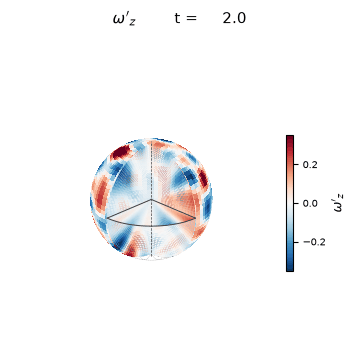

# Spherical Convection

Simulates rotating convection in a **spherical shell** and renders an animated
3-D cutaway of the z-component of vorticity (ω′_z).



## Physics

Solves the **barotropic vorticity equation** on a rotating sphere using a
spectral method (real spherical harmonics via `pyshtools`):

```
∂ω/∂t + J(ψ, ω + f) = −ν (−∇²)⁴ ω − μ ω + F
```

where
- ω = ∇²ψ is the relative vorticity, ψ the streamfunction
- f = 2Ω sin φ is the planetary vorticity (Coriolis)
- J is the Jacobian (advection)
- ν (−∇²)⁴ is scale-selective **∇⁸ hyperviscosity** — sets the small-scale
  (filament) cutoff near the spectral truncation
- μ is a uniform **linear (Rayleigh) drag** — removes large-scale energy so the
  forced–dissipative turbulence reaches a *statistically steady* state instead
  of piling up into an ever-growing condensate
- F is stochastic forcing injecting enstrophy at l = 18–45

Rapid rotation (high Ω) enforces the **Taylor–Proudman constraint**, producing
elongated "banana cell" columns aligned with the rotation axis. Weak
hyperviscosity leaves a wide enstrophy inertial range, so the field is threaded
with **thin vorticity filaments**.

## Visualisation (`visualize.py`)

A 3-D sphere with an **octant cutaway** — the wedge `0° ≤ lon < 90°  ∧  lat > 0`
is removed, exposing three interior faces plus the inner core:

- coloured **outer surface** (ω′_z), octant hole-punched
- **equatorial** quarter-annulus (z = 0, r ∈ [R_inner, R_outer])
- two **meridional** faces (lon = 0°, 90°; upper half of the shell)
- the **inner core** — a sphere of radius R_inner coloured by its own slow,
  low-degree (l = 2–6) vorticity field at reduced amplitude (a smaller, calmer
  version of the outer convection), with a thick black boundary curve plus one
  thin intermediate layer boundary

Interior vorticity on the cut faces is reconstructed from the surface field with
a **spherical-shell mapping**: the value at an interior point (r, θ, φ) is taken
from the surface at the *same* colatitude/longitude (θ, φ) and modulated
radially — a smooth inward decay plus a couple of radial modes that vanish at
both boundaries. Structures therefore curve with the shell (concentric annuli on
the equatorial cut, arcs on the meridional walls) instead of forming vertical
columns, and still join the surface colours seamlessly at the rim.

Latitude/longitude graticule lines are **solid on the camera-facing side** and
**dashed where hidden** behind the sphere. Everything that must occlude
everything else is emitted into a single depth-sorted `Poly3DCollection` so the
outer surface, inner core and cut faces occlude each other correctly.

Red = cyclonic (+ω′_z), blue = anticyclonic (−ω′_z), white = zero.

## Quick start

```bash
pip install -r requirements.txt
python render_movie.py          # produces output.gif
python render_movie.py --mp4    # also produces output.mp4 (+ copies to iCloud)
```

The MP4 is encoded directly with the system `ffmpeg` (raw RGB → libx264,
yuv420p) and a copy is pushed to the iCloud "Claude" drop zone
(`ICLOUD_MP4` in `config.py`).

## File layout

| File | Purpose |
|------|---------|
| `config.py` | Physical, numerical and rendering parameters |
| `simulate.py` | Spectral vorticity solver (RK2 + implicit dissipation) |
| `visualize.py` | 3-D spherical-shell cutaway renderer |
| `render_movie.py` | Pipeline: simulate → render → GIF + MP4 |
| `requirements.txt` | Python dependencies |

## Key parameters (`config.py`)

| Parameter | Default | Description |
|-----------|---------|-------------|
| `R_INNER` | 0.35 | Inner-core radius (r_inner / r_outer) |
| `OMEGA` | 15.0 | Non-dimensional rotation rate |
| `LMAX` | 85 | Spectral truncation (T85) |
| `NU_HYPER` | 3e-15 | ∇⁸ hyperviscosity coefficient |
| `LINEAR_DRAG` | 0.25 | Large-scale Rayleigh drag |
| `FORCE_LMIN/MAX` | 18 / 45 | Forcing band (spherical-harmonic degree) |
| `DT` | 2e-3 | Non-dimensional timestep |
| `N_SPINUP` | 5000 | Spin-up steps before recording |
| `N_FRAMES` | 200 | Frames in the animation |
| `VIEW_ELEV/AZIM` | 24° / 40° | Camera looking into the cutaway |
